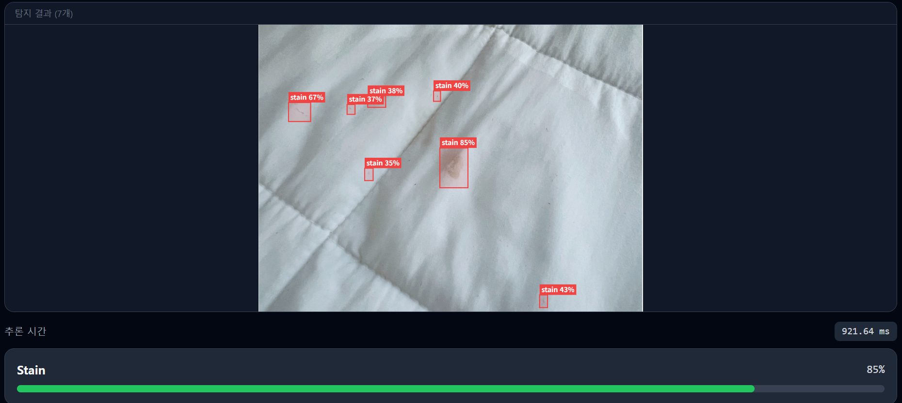
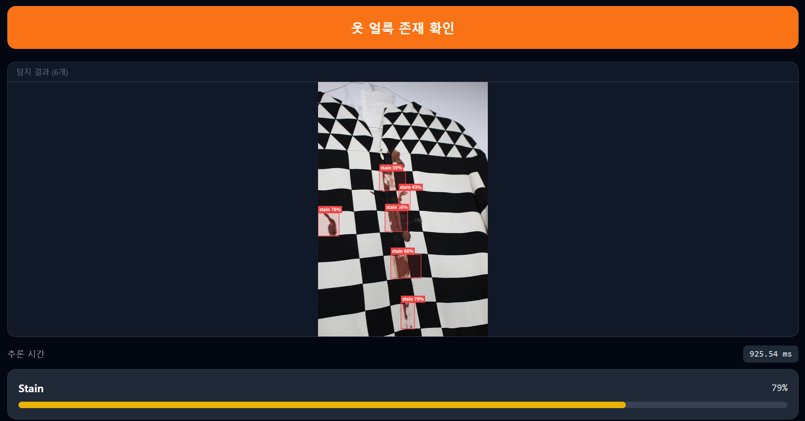

<div align="center">

# 💻 MicroLens Client

### 일상 속 미세한 부분까지, 대신 확인해주는 시력보조 파트너 — 웹 클라이언트

**React + Vite 기반으로 의류 얼룩 탐지/분류, 치아 이물질 탐지 결과를 브라우저에서 바로 확인합니다.**


🌐 **서비스**: [microlens.cloud](https://microlens.cloud/) · 📹 **시연 영상**: [YouTube](https://youtu.be/7jnekg9lZeo)

[](https://youtu.be/7jnekg9lZeo)

</div>

---

## 📌 프로젝트 소개

MicroLens는 **2023 배리어프리 앱 개발 콘테스트 우수상**을 수상한 시각장애인용 옷 얼룩 탐지 앱 [Stainless](https://github.com/catapillar0505/Stainless)를 웹 서비스로 발전시킨 **1인 프로젝트**입니다. 이 저장소는 사용자가 이미지를 업로드하고 AI 탐지 결과를 확인하는 웹 클라이언트입니다.

## 🖼️ 시연 화면

| 얼룩 탐지 (신뢰도 90%) | 미세 얼룩 다중 탐지 (7개) |
|:---:|:---:|
|  |  |

| 무늬 있는 옷에서도 얼룩만 정확히 탐지 |
|:---:|
|  |

---

## 설계 배경 및 의사결정

### v1 — 온디바이스 실시간 (YOLOv5 + TFLite)

초기 버전의 핵심 UX 시나리오는 다음과 같았습니다.

> 핸드폰을 옷 가까이 들이대고 카메라를 천천히 움직인다.
> 얼룩이 감지되면 음성 알림이 울린다.
> 음성이 울린 순간 손이 멈춘 위치에 얼룩이 있다.

별도의 화면을 보지 않아도 되는, 마치 금속탐지기처럼 사용하는 시나리오였습니다.
이를 위해 카메라 프레임마다 즉각적인 추론이 필요했기 때문에 YOLOv5를 TFLite로 경량화하여 온디바이스에서 실시간 동작하도록 구현했습니다.

### v1의 한계 — 실시간보다 데이터가 문제였다

실제로 실행해보니 **눈에 띄는 얼룩은 잘 찾지만 연하거나 미세한 얼룩은 탐지하지 못하는 문제**가 있었습니다.
이는 온디바이스 환경의 한계가 아니라, **자연스러운 의류 얼룩 데이터를 수급하기 어렵다는 데이터 한계**가 본질적인 원인이었습니다.

### v2로의 전환 — 실시간 집착을 버리다

데이터 한계를 인정하고 나면, 굳이 실시간성에 집착할 이유가 없어집니다.

의류 얼룩 탐지의 실제 사용 목적은 **외출 전, 약속 전에 눈에 띄는 얼룩이 있는지 없는지 확인하는 것**입니다.
미세하거나 연한 얼룩은 현재 기술 수준으로는 어차피 탐지하기 어렵고, 그런 얼룩은 육안으로도 보이지 않으므로 외출 시 문제가 되지 않습니다.

따라서 **"정지된 이미지를 찍어서 분석"하는 UX로 전환**하고, 실시간 제약에서 벗어나 서버 추론으로 정확도를 높이는 방향을 선택했습니다. (YOLOv5 mAP50 0.55 → YOLOv12 **0.8**)

### v2의 모델 선택 — YOLOv12

서버 추론 환경에서는 모바일 연산 제약이 사라지므로, YOLOv12의 **Area Attention 메커니즘**을 활용합니다.

- **비정형 얼룩 탐지에 최적:** 얼룩은 테두리가 흐릿하고 모양이 일정하지 않습니다. CNN 기반 모델은 국소 특징에 집중하는 반면, YOLOv12는 이미지 전체 맥락에서 "옷의 무늬 vs 오염물"을 더 정교하게 구분합니다. 위 시연 화면처럼 체크무늬 옷에서도 무늬를 얼룩으로 오탐지하지 않습니다.
- **모델 상세**: 모델 개선 여정(mAP50 0.55 → 0.8)과 추론 서버 구현은 [microlens-ai-api](https://github.com/MICRO-LENS/microlens-ai-api)에서 확인할 수 있습니다.

### 왜 Android가 아닌 웹인가

실시간 스캔이 없다면 Android의 핵심 강점이 사라집니다.
**촬영 후 분석** UX는 웹에서도 동일하게 구현할 수 있고, 오히려 다음 장점이 생깁니다:

- **즉시 데모 가능**: APK 설치 없이 URL 하나로 접근
- **카메라 지원**: 브라우저 `getUserMedia` API로 촬영 가능
- **파일 업로드**: 갤러리/드래그앤드롭 이미지 분석

### 왜 React + Vite인가

이 앱의 역할은 **이미지 업로드 → API 호출 → 결과 표시** 가 전부입니다.
빌드 결과물이 순수 정적 파일(HTML/JS/CSS)이므로 nginx 컨테이너 하나로 K8s에 배포할 수 있고,
기존 Jenkins → ECR → ArgoCD 파이프라인을 그대로 재사용합니다.

---

## 기술 스택

| 분류 | 기술 |
|------|------|
| 프레임워크 | React 18 + Vite |
| 언어 | TypeScript |
| 스타일링 | Tailwind CSS |
| HTTP 클라이언트 | fetch (multipart/form-data) |
| 카메라 | `getUserMedia` API |
| 컨테이너 | nginx (정적 파일 서빙) |

---

## 주요 기능

### 1. 이미지 입력
- 카메라 촬영 (모바일/데스크톱 브라우저)
- 파일 업로드 (드래그앤드롭 포함)

### 2. 분석 서비스 선택
- 의류 얼룩 탐지 (`POST /stain/detect`)
- 의류 얼룩 분류 (`POST /stain/classify`)
- 치아 이물질 탐지 (`POST /teeth/check`)

### 3. 결과 시각화
- 바운딩 박스 오버레이 (Canvas API)
- 레이블 + 신뢰도 표시
- 추론 시간(ms) 표시

### 4. 얼룩 제거 가이드
- 탐지·분류된 얼룩 종류(음료/음식/펜)에 맞는 **얼룩 지우는 방법 안내** (`StainRemovalGuide`)
- 탐지에서 끝나지 않고 "그래서 어떻게 지우지?"까지 해결하는 UX

---

## 디렉토리 구조

```
microlens-client/
├── src/
│   ├── App.tsx
│   ├── pages/
│   │   ├── StainPage.tsx           # 얼룩 탐지/분류 페이지
│   │   ├── TeethPage.tsx           # 치아 이물질 탐지 페이지
│   │   └── ContactPage.tsx         # 문의 페이지
│   ├── components/
│   │   ├── ImageUploader.tsx       # 카메라 촬영 + 파일 업로드
│   │   ├── ResultCanvas.tsx        # 바운딩 박스 오버레이
│   │   ├── DetectionResult.tsx     # 탐지 결과 카드
│   │   └── StainRemovalGuide.tsx   # 얼룩 종류별 제거 방법 가이드
│   └── lib/
│       └── api.ts                  # AI API 호출 함수
├── nginx.conf                  # 정적 파일 서빙 설정
├── Dockerfile                  # nginx 기반 멀티 스테이지 빌드
├── docker-compose.yml          # 로컬 빌드 검증용
├── .env.example
└── index.html
```

---

## 배포 흐름

기존 AI API 서비스들과 동일한 파이프라인을 사용합니다.

```
GitHub Push
  → Jenkins: docker build (nginx + 정적 파일) → ECR Push
  → kustomize 이미지 태그 업데이트 → git push
  → ArgoCD: K8s 자동 배포
  → Nginx Ingress: / → microlens-client 서비스
```

---

## 환경 변수

```env
VITE_API_BASE_URL=http://<ingress-nginx-external-ip>
```

> 운영 배포에서는 `VITE_API_BASE_URL=""`(상대 URL)로 빌드해 동일 도메인의 Ingress 경로를 사용합니다.

---

## 로컬 개발

```bash
npm install
npm run dev
# http://localhost:5173
```

---

## 관련 저장소

- 🏗️ [microlens-infra](https://github.com/MICRO-LENS/microlens-infra) — AWS 인프라 및 Kubernetes 배포 (Terraform · Ansible · ArgoCD)
- 🔬 [microlens-ai-api](https://github.com/MICRO-LENS/microlens-ai-api) — FastAPI AI 추론 서버 (YOLOv12 · ONNX Runtime)
- 👕 [Stainless](https://github.com/catapillar0505/Stainless) — 전신 프로젝트 (2023 배리어프리 앱 개발 콘테스트 우수상)
